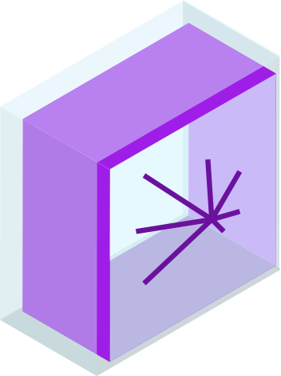
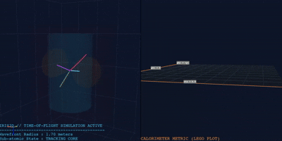
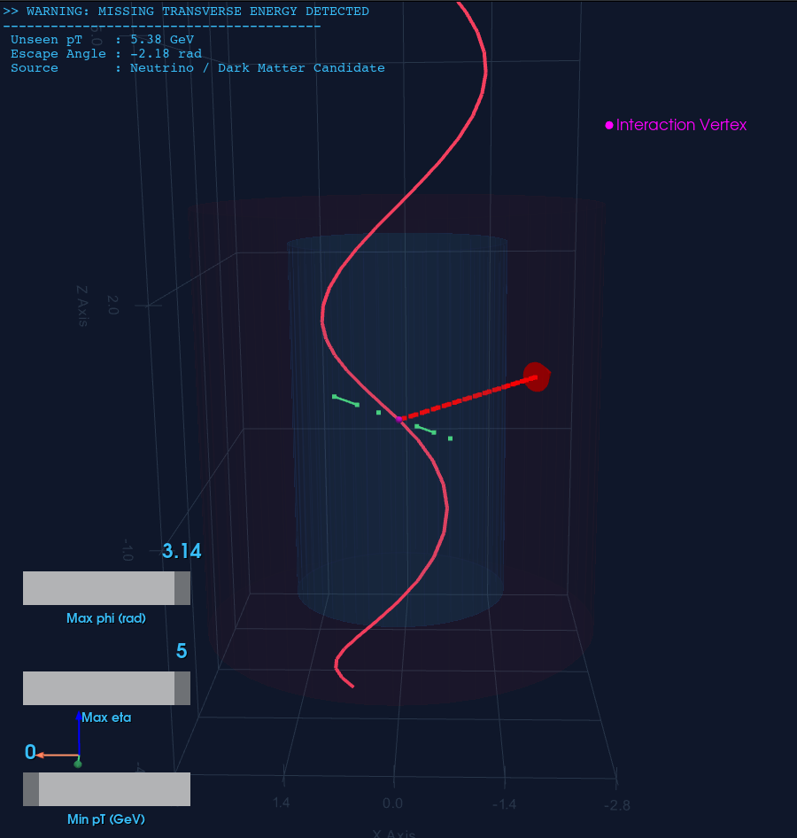
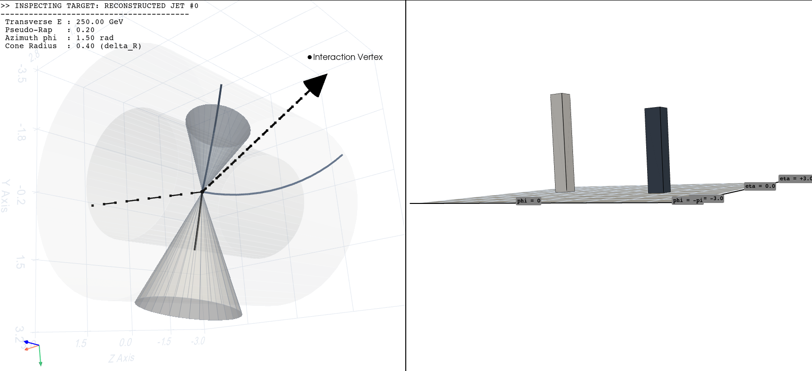

<br />
<div align="center">
  <a href="https://github.com/paulhenry46/Iris3D">
    
  </a>

  <h3 align="center">Iris3D</h3>
  </div>
Iris3D is a lightweight, high-performance Python lib built for high-energy physics (HEP) analysis. Powered by PyVista and VTK, it brings sub-atomic collision data to life inside an interactive, GPU-accelerated 3D viewport.

Iris3D features a **fully polymorphic ingestion engine** that natively accepts lightweight standard Python rows, columnar NumPy blocks, or heavy CERN Awkward Records from standard analysis pipelines.

It models physical mechanics directly on your screen—calculating realistic track helices bending within an active magnetic field, extruding calorimeter deposits into localized 3D opening cones, and morphing real-time energy clusters into dual-screen 2D unfolded LEGO plots. It has built-in features for live kinematic resonance analysis, interactive filtering widgets, and instant single-key exports to publication-ready images, standalone interactive HTML web pages, or cinematic videos.

## Screenshot
### Animated mode

### Interactive mode



##  Supported Input Formats

The `load_event()` ingestion pipeline is fully polymorphic. It normalizes data from three distinct data layouts into a unified internal event structure.

### FORMAT 1: Row-Oriented Layout
Inside the `particles` and `jets` keys, data is structured as a **list of independent dictionaries** (one dict per object). The ingestion parser is resilient to extraneous keys and fills in missing optional parameters (like `delta_r`) using standard defaults.

```python
row_based_data = {
    "metadata": {
        "run_id": 402130,
        "event_id": 8943210,
        "sqrts_gev": 13600.0
    },
    "particles": [
        {"pt": 45.2, "eta": 1.2, "phi": -0.5, "charge": -1, "pid": 11, "name": "e-"},
        {"pt": 38.1, "eta": -0.8, "phi": 2.6, "charge": 1, "pid": -11, "name": "e+"},
        {"pt": 2.1, "eta": 2.4, "phi": 1.1, "charge": 0, "pid": 22, "name": "gamma", "ignored_extra_key": True} 
    ],
    "jets": [
        {"energy": 120.5, "eta": 0.4, "phi": -1.2, "delta_r": 0.4},
        {"energy": 85.0, "eta": -1.9, "phi": 1.8} # Automatically falls back to default delta_r=0.4
    ]
}

event_from_rows = load_event(row_based_data)

```

### FORMAT 2: Columnar Data Layout
Inside `particles` and `jets`, fields are structured as a **dictionary of parallel arrays/vectors**. Every feature array must have matching dimensions. The parser automatically sanitizes low-level data structures, including decoding byte strings (`b"mu+"`) to standard text string structures.

```python
import numpy as np

columnar_data = {
    "metadata": {
        "run_id": 402130,
        "event_id": 8943211
    },
    "particles": {
        "pt": np.array([55.4, 12.3], dtype=np.float32),
        "eta": np.array([0.15, -2.1], dtype=np.float32),
        "phi": np.array([-2.8, 0.9], dtype=np.float32),
        "charge": np.array([1, -1], dtype=np.int32),
        "pid": np.array([13, -13], dtype=np.int32),
        "name": np.array([b"mu+", b"mu-"]) # Automatic byte-string to utf-8 conversion
    },
    "jets": {
        "energy": np.array([210.0]),
        "eta": np.array([0.05]),
        "phi": np.array([-1.4]),
        "delta_r": np.array([0.4])
    }
}

event_from_columns = load_event(columnar_data)

```

### FORMAT 3: Awkward Records Layout
This format processes an encapsulated native **`ak.Record`** representing an individual jagged-array event slice. It seamlessly unpacks variable-length records, converting Awkward categories and text mappings directly into interactive 3D graphical primitives.

```python
import awkward as ak

awkward_data = ak.Record({
    "metadata": {
        "run_id": 402130,
        "event_id": 8943212,
        "sqrts_gev": 13600.0
    },
    "particles": {
        "pt": ak.Array([85.0, 62.1, 4.5]),
        "eta": ak.Array([-0.4, 0.9, 1.1]),
        "phi": ak.Array([1.7, -2.1, 0.3]),
        "charge": ak.Array([-1, 1, 0]),
        "pid": ak.Array([11, 13, 22]),
        "name": ak.Array(["e-", "mu+", "gamma"])
    },
    "jets": {
        "energy": ak.Array([340.5]),
        "eta": ak.Array([0.85]),
        "phi": ak.Array([-1.9]),
        "delta_r": ak.Array([0.4])
    }
})

event_from_awkward = load_event(awkward_data)

```

### Summary of Feature Mappings Across All Formats

No matter which layout you feed into `load_event()`, the parser guarantees mapping across all 3 key blocks:

1. **`metadata`**: Extracted scalars populate the top-left HUD info banner.
2. **`particles`**: Curvature orientation is calculated based on `charge`. Tracks with `charge: 0` are drawn as neutral dashed vectors.
3. **`jets`**: `energy`, `eta`, and `phi` specify opening cones in the 3D event viewport and elevate bin pillars in the 2D unfolded LEGO subplot.

## Manual

The `EventVisualizer` class is the central engine of **Iris3D**. It orchestrates fluid, GPU-accelerated 3D rendering of high-energy physics collision events using PyVista and VTK. It features smart particle identification color-coding, interactive track/jet selection, kinematic analysis tools (like live invariant mass tracking), dynamic kinematical filters, and multi-format export capabilities.

---

## Class Initialization & Custom Themes

### `__init__(theme: str | dict = "cyberpunk")`

Initializes the visualizer canvas. You can load a pre-configured theme blueprint or pass a custom layout dictionary.

* **Parameters:**
* `theme` (`str` or `dict`): The name of a built-in theme (`"cyberpunk"`, `"publication"`, etc.) or a custom dictionary defining color primitives. If a requested theme name is missing, it falls back to `"cyberpunk"`.


* **Example Usage:**
```python
from iris3d import EventVisualizer

# Initialize using the default cyberpunk aesthetic
visualizer = EventVisualizer(theme="cyberpunk")

```

## Core Methods

### 1. Static Display Mode (`plot_event`)
Renders a static snapshot of the collision event with full access to interaction widgets, mouse picking, and subplots.

```python
plot_event(
    event: CollisionEvent, 
    mode: str = "both", 
    p_scale: float = 1.0, 
    j_scale: float = 0.01, 
    B_field: float = 3.8
)

```

* **Parameters:**
* `event` (`CollisionEvent`): The underlying event structure containing the processed meta, tracks, and jet blocks.
* `mode` (`str`): Layout style. Options are:
* `"both"`: **Split Screen.** Displays the 3D detector view on the left, and an unfolded 2D $(\eta, \phi)$ calorimeter Lego plot on the right.
* `"detector"`: Full window view dedicated solely to the 3D geometry layout.
* `"lego"`: Full window view dedicated solely to the 2D histogram towers.


* `p_scale` (`float`): Magnification factor for scaling particle lengths.
* `j_scale` (`float`): Scale coefficient for the length computation of jet cones.
* `B_field` (`float`): Solenoidal magnetic field strength in Tesla (defaults to the CMS benchmark of $3.8\text{ T}$). Controls tracking helix bending equations.


### 2. Cinematic Animation Mode (`animate_event`)

Triggers an off-screen sub-stepping interpolation routine that plays back the time-of-flight wavefront of the collision. Beams approach along the $Z$-axis, collide at the vertex $(0,0,0)$, and scatter outward through the layers in real time.

```python
animate_event(
    event: CollisionEvent, 
    mode: str = "both", 
    p_scale: float = 1.0, 
    j_scale: float = 0.01, 
    B_field: float = 3.8, 
    speed: float = 0.05
)

```

* **Parameters:** Same as `plot_event`, with the addition of:
* `speed` (`float`): Radial step advancement velocity ($m/\text{frame}$) of the expanding collision wavefront.


* **Animation Control:**
* Press the **`Spacebar`** live to pause/resume the expansion wavefront at any timestamp (e.g., to pause right during the calorimeter showering phase).

##  Live Window Controls & Keyboard Shortcuts

When looking at either a static or animated visualizer viewport, you can interact with the scene using your mouse and keys:

### Mouse-Picking Mechanics (Static only)

* **Single Left Click:** Selects an element (track or jet) and highlights it in **White**. Detailed information (Kinematics, PDG ID identity, Energy) is instantly printed onto the upper-left Head-Up Display (HUD) canvas banner.
* **`[SHIFT]` + Left Click:** **Relativistic Resonance Analysis Mode.** Select exactly 2 particle tracks while holding `SHIFT`. They will flash **Cyan**, and the engine will instantly calculate and display their spatial separation $\Delta R$ and combined **Invariant Mass $M_{(ab)}$** directly on the HUD screen.

### Dynamic Cinematic Sliders (Static)

In static mode, three interactive sliders appear on the bottom-left corner of the 3D viewport:

1. **Min $p_T$ (GeV):** Dynamically filters out low-energy background clutter.
2. **Max $\eta$:** Restricts the longitudinal acceptance window.
3. **Max $\phi$ (rad):** Truncates the azimuthal cross-section view.

* **Ghost Mode Implementation:** Filtered tracks do not disappear completely; they enter a semi-transparent *Ghost Mode* (3% opacity) and become non-pickable, allowing you to isolate primary hard scatterings without losing full event context.


### Complete Keyboard Shortcuts Reference Table

| Key | Action | Ingress Target / Description |
| --- | --- | --- |
| **`c`** | **Toggle Selection Filter** | Swaps mouse targeting between **Particles Mode** and **Jets Mode**. (Cones are unpickable on startup to allow easy access to inner tracking lines). |
| **`f`** | **Toggle Filter Sliders** | Cleanly hides or unhides the $p_T, \eta, \phi$ adjustment slider blocks to declutter the viewport. |
| **`Space`** | **Pause Animation** | Freezes the expanding wavefront mid-flight during an animated run. |
| **`e`** | **Export Screenshot** | Automatically strips HUD text overlay and captures a crisp image asset. |
| **`h`** | **Export Interactive HTML** | Compiles the entire 3D mesh architecture into a portable, WebGL-ready standalone `.html` page. Requires the Jupyter backend. Run `pip install "pyvista[jupyter]"` before using. |
| **`r`** | **Export Spin Video** | Triggers the export module to record a clean, 360-degree orbital movie rotation of the scene. Requires video encoding libraries. Run `pip install imageio imageio-ffmpeg` before using |


## Custom Themes

**Iris3D** comes packaged with built-in visual identities like `"cyberpunk"`, but it also gives you complete aesthetic control over your event displays. You can customize the look of the passive detector structures, backgrounds, HUD text, and individual particle tracks by passing a theme configuration dictionary directly during initialization.

### Theme Dictionary Blueprint

A theme dictionary contains hex or standard VTK string color rules mapping to specific graphics primitives. Below is the reference blueprint structure (using the default `"cyberpunk"` config as an example):

```python
custom_theme = {
    "dark": True,                     # Toggles PyVista dark plotting background context
    "bg_detector": "#0f172a",          # 3D canvas background color
    "bg_lego": "#090d16",              # 2D unfolded histogram background color
    "grid_color": "#273549",           # Reference grid line color
    "hud_text": "#38bdf8",             # On-screen HUD text overlays
    "lego_title": "#fb923c",           # Title header on the Lego canvas
    
    # Passive Detector Elements
    "detector_ecal": "crimson",        # Outer calorimeter shell surface color
    "detector_ecal_edge": "firebrick", # Calorimeter boundary mesh lines
    "detector_tracker": "deepskyblue", # Inner tracker cylinder volume color
    "detector_tracker_edge": "dodgerblue", # Inner tracker boundary lines
    "beam": "#38bdf8",                 # High-energy packet beam lines (animation)
    "vertex_static": "magenta",        # Interaction point marker in static plots
    "vertex_anim": "gray",             # Colliding state packet color in animation
    "shockwave": "orange",             # Radial collision wavefront hull 
    
    # Physics Signatures
    "jet_cone": "orange",              # 3D clustered shower cones
    "jet_cone_edge": "darkorange",     # 3D cone mesh outlines
    "jet_tower": "orange",             # 2D LEGO plot histogram boxes
    "jet_tower_edge": "white",         # 2D LEGO tower boundary lines
    "lego_floor": "#1e293b",           # 2D histogram baseline layout plane
    "lego_floor_edge": "#334155",      # 2D layout grid lines
    "met": "red",                      # Missing Transverse Energy ($\vec{E}_T^{\text{miss}}$) vector
    
    # Particle-ID Specific Color Mapping (PDG Keys)
    "particles": {
        11: "#38bdf8",     # Electron (e-)
        -11: "#38bdf8",    # Positron (e+)
        13: "#a855f7",     # Muon (mu-)
        -13: "#a855f7",    # Antimuon (mu+)
        22: "#4ade80",     # Photon (gamma)
        211: "#f43f5e",    # Charged Pion (pi+)
        -211: "#f43f5e",   # Charged Pion (pi-)
        "default": "#94a3b8" # Fallback color for unmapped/exotic tracks
    }
}

```

### Mapping Custom Particles

The `"particles"` sub-dictionary supports standard **PDG ID integer keys**. If your simulation includes custom or rare tracking signatures, you can simply expand the dictionary with their respective PDG integers:

```python
# Extending particle mapping to highlight exotic BSM states
my_theme = {
    "particles": {
        1000022: "#facc15",  # Highlight Neutralinos (~chi_1^0) in Bright Yellow
        25: "#ec4899",       # Highlight Higgs bosons (H) in Hot Pink
        "default": "#64748b" # Standard muted gray for background pile-up tracks
    }
}

```

### Load a Custom Theme

To apply your styling rules, pass your dictionary to the `theme` parameter when initializing the `EventVisualizer`.

> You do not need to specify every single key! The framework features an internal validation layer. It scans your custom dictionary and automatically pads any missing visual parameters using the robust `"cyberpunk"` theme.

```python
from iris3d import EventVisualizer

# 1. Define custom elements (only specify what you want to change)
minimal_clean_theme = {
    "dark": False,
    "bg_detector": "#ffffff",    # Force clean white layout
    "grid_color": "#e2e8f0",
    "hud_text": "#0f172a",
    "particles": {
        13: "#3b82f6",           # Force all Muons to show up Blue
        -13: "#3b82f6",
        "default": "#94a3b8"
    }
}

# 2. Inject the custom configuration into the pipeline
vis = EventVisualizer(theme=minimal_clean_theme)

# 3. Call your plotting logic as usual
vis.plot_event(my_hep_event, mode="both")

```